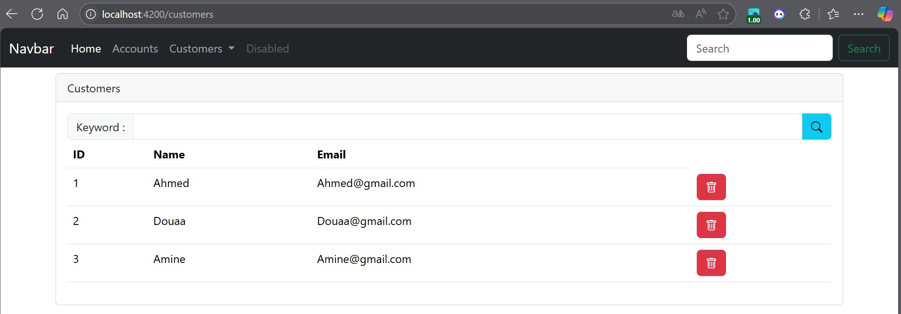
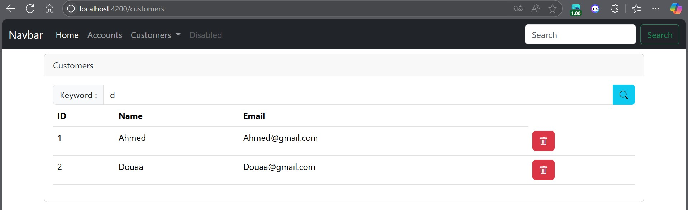
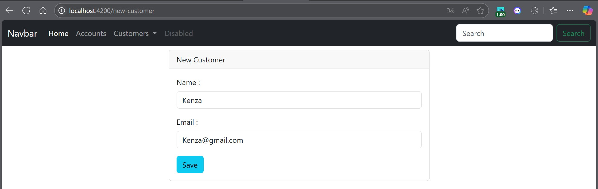
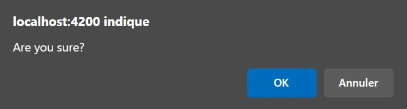
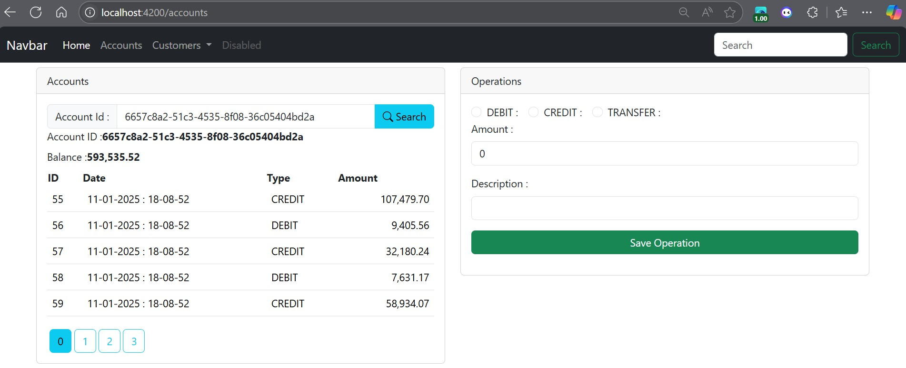
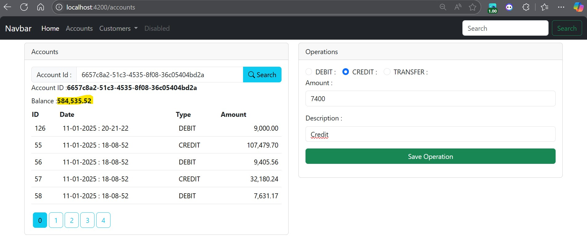
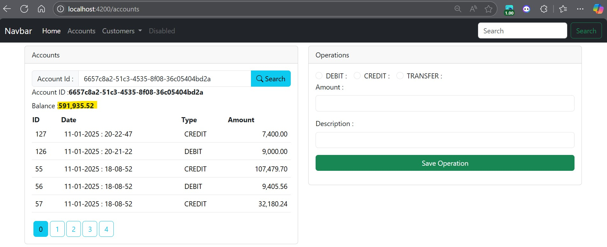
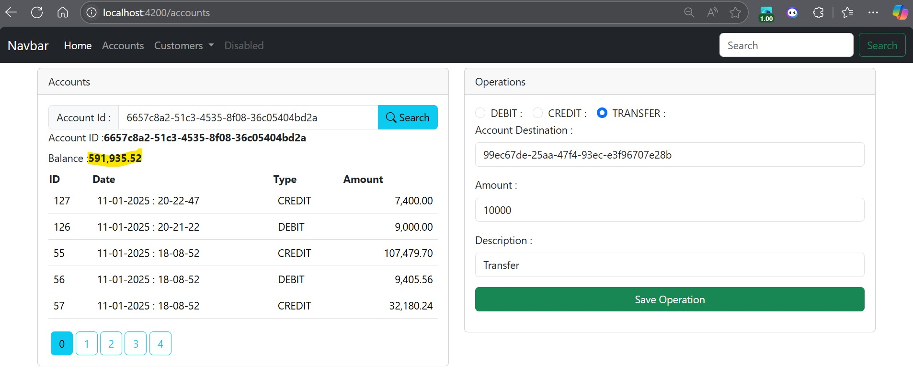
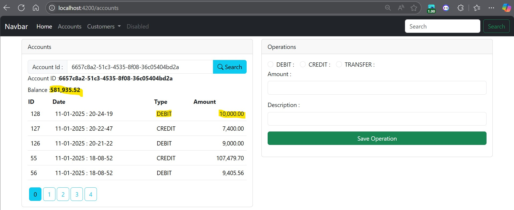
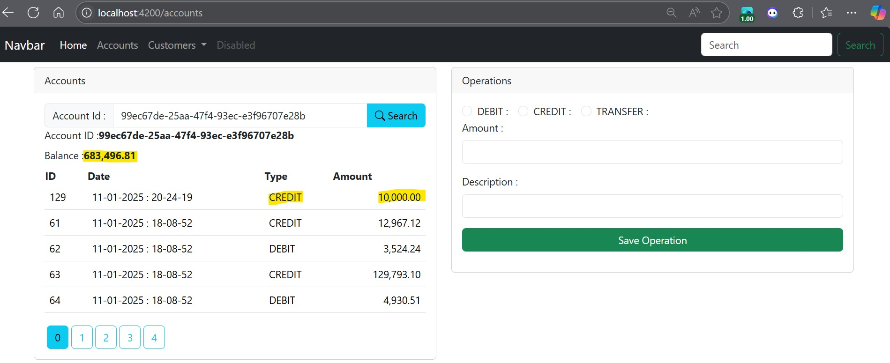

<h1>Projet JEE - Digital banking - Frontend</h1>

Une application de gestion de comptes bancaires où chaque client possède des comptes (courants ou épargnes) pouvant enregistrer des opérations de débit et crédit.

<h2>Gestion des clients</h2>

<h3>Rechercher tous les clients</h3>

<h3>Rechercher les clients par mot cle</h3>

<h3>Ajout d'un nouveau client</h3>

<h3>Affichage d'une alerte de succes</h3>

<h3>Affichage d'un message de validation pendant la suppression</h3>

<h3>Affichage d'un message d'erreur au cas ou l'url est mal ecrit</h3>

<h2>Gestion des operations bancaires</h2>

<h2>Debit</h2>
<h3>L'Id du compte</h3>

<h3>Avant debit</h3>

<h3>Apres debit</h3>

<h2>Credit</h2>
<h3>Avant credit</h3>

<h3>Apres credit</h3>

<h2>Virements</h2>
<h3>Compte source - Avant virement</h3>

<h3>Compte source - Apres virement</h3>

<h3>Compte destination - Apres virement</h3>

----

